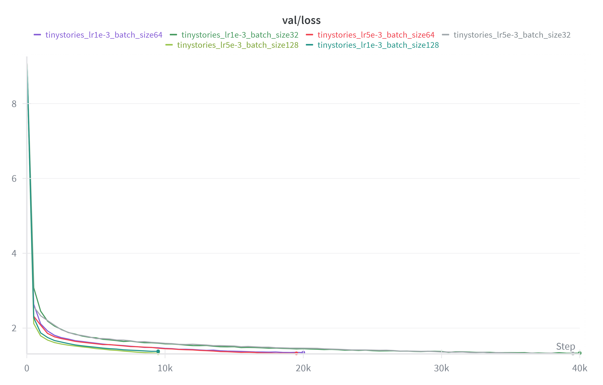
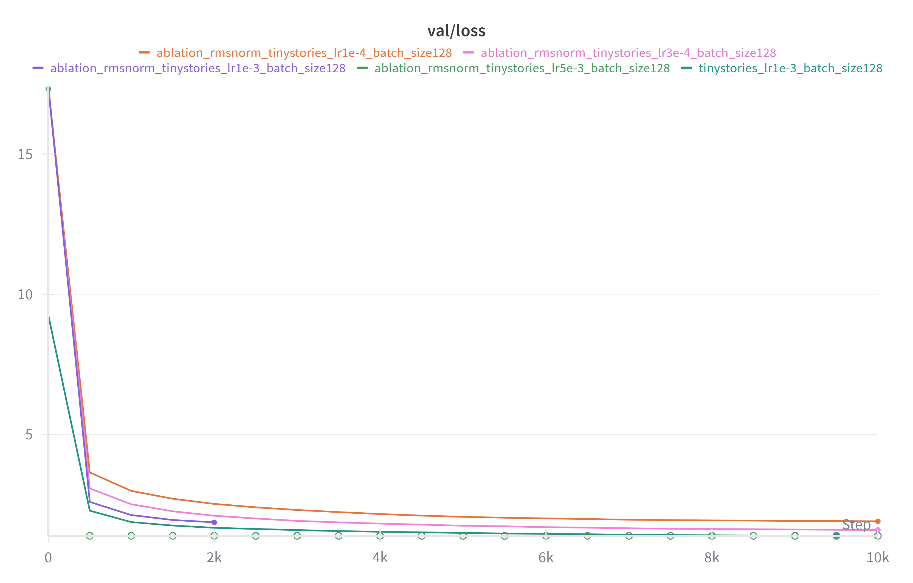
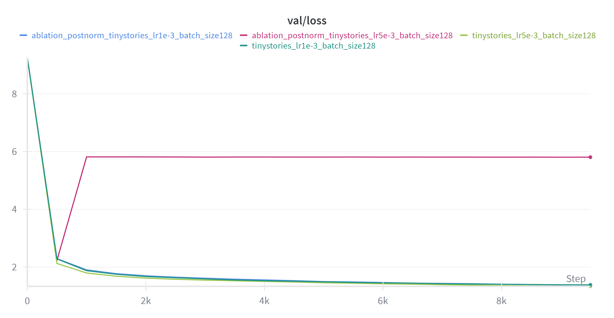
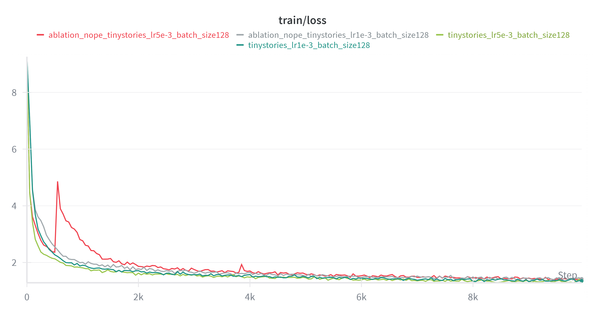
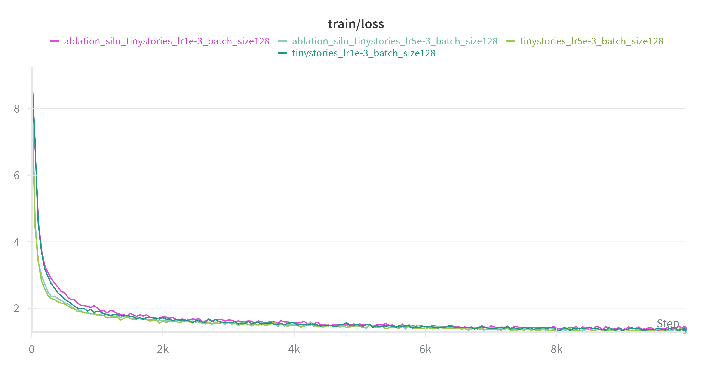

# Assignment 1 writeup

## BPE

### unicode1

**(a)** Unicode NULL 字符（U+0000）

**(b)** 转义字符 `\x00`，打印出来是不可见字符

**(c)** 出现在文本里面的话单纯是一个不可见字符

### unicode2

**(a)** UTF-8 完全兼容 ASCII 字符，编码更紧凑，更省空间。UTF16/32 占用空间更多且引入大量高位 0 字节，浪费序列长度，增加冗余噪声。

**(b)** “你好”即可（包含非 ASCII 字符）。因为这个函数是逐字节解码的，但是一个 Unicode 字符在 UTF-8 表示下可能不止需要一个字节来表示，所以会出现问题。

**(c)** `0xC0 0x80` 就不能被解码到任何 Unicode 字符上。

### train_bpe_tinystories

**(a)** 最长的 token 是 `b' accomplishment'`，长度为 15 bytes。作为一个长单词还是 make sense 的。

**(b)** profile 结果如下：

```
╭──────────────────────────────────────╮
│ Profiling Results - Top 20 Functions │
╰──────────────────────────────────────╯
         12124629 function calls (11835671 primitive calls) in 265.282 seconds

   Ordered by: cumulative time
   List reduced from 820 to 20 due to restriction <20>

   ncalls  tottime  percall  cumtime  percall filename:lineno(function)
1681/1676    0.028    0.000  828.211    0.494 threading.py:641(wait)
       68    0.136    0.002  441.270    6.489 pool.py:500(_wait_for_updates)
     1680    0.374    0.000  317.713    0.189 live.py:244(refresh)
     1696    0.553    0.000  298.228    0.176 console.py:1648(print)
37179/6803    0.795    0.000  291.716    0.043 {method 'extend' of 'list' objects}
      3/1    0.698    0.233  266.180  266.180 utils.py:60(wrapper)
        1    3.867    3.867  265.482  265.482 bpe.py:34(train_bpe)
        2    0.000    0.000  259.642  129.821 progress.py:1184(__exit__)
        2    0.000    0.000  259.642  129.821 progress.py:1173(stop)
        2    0.004    0.002  259.642  129.821 live.py:145(stop)
 1691/242    0.875    0.001  249.091    1.029 threading.py:327(wait)
 6822/982  156.461    0.023  247.430    0.252 {method 'acquire' of '_thread.lock' objects}
  313/311    0.658    0.002  227.481    0.731 {built-in method posix.read}
       52    0.001    0.000  227.312    4.371 connection.py:246(recv)
  108/106    0.007    0.000  226.992    2.141 connection.py:390(_recv)
    54/53    0.002    0.000  226.820    4.280 connection.py:429(_recv_bytes)
        1    0.000    0.000  226.813  226.813 pretokenization.py:91(pretokenize)
        1    0.000    0.000  226.738  226.738 pool.py:738(__exit__)
        1    0.000    0.000  226.730  226.730 pool.py:654(terminate)
       52    0.000    0.000  226.680    4.359 util.py:276(__call__)
```

发现 `pretokenize` 函数耗费了约 227 秒，占训练时间的大头。瓶颈可能主要来源于 I/O 和多进程结果合并。实际的 BPE merge 只占大约 32 秒。

### train_bpe_expts_owt

**(a)** 最长的 token 为 `ÃÂÃÂÃÂÃÂÃÂÃÂÃÂÃÂÃÂÃÂÃÂÃÂÃÂÃÂÃÂÃÂ`，可能源于 OpenWebText 数据集直接爬取网络数据，而这些数据在反复 encode 和 decode 的时候编码出现了问题。虽然这种模式在整个数据集中只出现了 218 次，但其中有一些极长的连续重复（比如 31607 次重复），BPE 会不断 merge 这些重复模式，最终形成非常长的 token，这种极长连续形式导致了最长 token 是这种 mojibake 的形式。

**(b)** 分析最长 token 发现 TinyWebStories 中的全是正常的英文单词而 OpenWebText 的包含 mojibake 和分隔符。不过前者的很多 token 在后者中也有出现。BPE 反应了这俩数据集的特征：一个干净而一个含有噪声。

## Transformer Language Model Architecture

### transformer_accounting

**(a)** 可训练参数：

- embedding + output linear 有 $V\times d$
- 每层 Transformer Block：
  - $W_Q,W_K,W_V,W_O$ 有 $4d^2$ 
  - 由于此处 $d_{ff} = 4d$，所以默认是传统 MLP 了。一层 up 一层 down 有 $2 d\cdot d_{ff}$
  - 两个 RMSNorm，一共 $2d$
- 最终的 RMSNorm，$d$

所以一共有 $2Vd + N(4d^2 + 2d\cdot d_{ff} + 2d) + d = 2Vd+N(12d^2+2d)+d$，代入参数计算得到约 1.64B，float32 的话约 6.1GB

**(b)** 设 context_length 为 $L$：

  - Q/K/V 投影：3 次 $(L\times d)\cdot(d\times d)$ → $6 L d^2$
  - O 投影：1 次 $(L\times d)\cdot (d\times d)$ → $2 L d^2$
  - 注意力分数：$QK^\top$ $(L\times d)\cdot (d\times L)$ → $2 L^2 d$
  - 注意力加权：$\text{Attn}\cdot V$ $(L\times L)\cdot (L\times d)$→ $2 L^2 d$
  - FFN：$2 L d d_{ff}\times 2$ → $4 L d d_{ff}$
  - 所以一层的是 $8Ld^2 + 4L^2d + 4Ldd_{ff} = 24Ld^2 + 4L^2d$
  - 输出线性：$(L\times d)\cdot (d\times V)$ → $2 L d V$

所以是 $N(24Ld^2+4L^2d)+2LdV$ 代入得到约 3.51 TFLOPS

**(c)** FFN 占约 57.4%，最大；注意力投影约 28.7%；注意力分数/加权约 9.2%；输出线性约 4.7%。

**(d)** 假设 GPT‑2 small/medium/large 都是 d_ff=4*d_model，且 $L=1024, V=50257$。各组件 FLOPs 占比如下（占总 FLOPs）：

| 模型                             | Attn proj | Attn inner | FFN    | LM head |
| -------------------------------- | --------- | ---------- | ------ | ------- |
| GPT-2 small (12L, d=768, h=12)   | 19.88%    | 13.25%     | 39.76% | 27.10%  |
| GPT-2 medium (24L, d=1024, h=16) | 24.93%    | 12.47%     | 49.86% | 12.75%  |
| GPT-2 large (36L, d=1280, h=20)  | 27.23%    | 10.89%     | 54.46% | 7.42%   |
| GPT-2 XL (48L, d=1600, h=25)     | 28.71%    | 9.19%      | 57.41% | 4.70%   |

随着模型变大，$d^2$ 规模的项（投影、FFN）比重上升，$L^2 d$ 的注意力分数项和输出线性（$L~d~V$）比重下降；因此 FFN 占比越来越大，输出线性占比快速降低。

**(e)** GPT‑2 XL 把 $L$ 从 1024 提到 16384（16 倍），$L^2$ 项增长 256 倍，其余 $L$ 项增长 16 倍。总 FLOPs 从 3.51e12 变为 1.33e14，约 38.05 倍；注意力分数/加权项占比跃升到 约 61.81%，FFN 降到约 24.14%，投影约 12.07%，输出线性约 1.97%。

## Training a Transformer LM

### learning_rate_tuning

对于 1e1，收敛很慢，对于 1e2，很快收敛到 1e-23 级别，对于 1e3，直接爆炸到 1e18 了。

### adamwAccounting

**(a)** 分析如下：

- 参数量见上，$P = 2Vd + N(12d^2+2d)+d$，占用显存 $M_{\text{param}} = 4P$ bytes
- 每个参数一个梯度，$M_{\text{grad}} = 4P$ bytes
- Adam 维护两个动量，$M_{\text{opt}} = 8P$ bytes
- Activations:
  - 每层 Transformer block:
    - RMSNorm $\times 2$：$2BLd$
    - QKV project：$3BLd$
    - $QK^\top$：$BhL^2$
    - softmax 输出：$BhL^2$
    - 加权求和输出： $BLd$
    - 最终投影：$BLd$
    - FFN：$BLd_{ff} + BLd_{ff} + BLd$
  - 所以 $A_{\text{layer}} = 16BLd+2BhL^2$
  - final RMSNorm：$BLd$
  - output logits：$BLV$
  - CELoss：$BLV$
  - 所以总共是 $A = N(16BLd+2BhL^2)+BLd+2BLV$
  - $M_{\text{act}} = 4A$ bytes
- 峰值显存为 $M_{\text{peak}} = 16P + 4A$ bytes

**(b)** 代入数据计算即可，解得 $B_{\max} = 3$

**(c)** $3B(L(24Ld^2+4L^2d)+2LdV) + \Theta(P)$

- Forward FLOPS：只考虑 matmul，则：$F_{\text{fwd}} = B(L(8Ld^2+4L^2d+4Ldd_{ff})+2LdV) = B(L(24Ld^2+4L^2d)+2LdV)$
- Backward FLOPS：近似两倍 $2F_{\text{fwd}}$ 以及一次逐元素 $F_{\text{adam}} = \Theta(P)$

**(d)** 每 step 的 FLOPS：$3\times 1024 \times (L(24Ld^2+4L^2d)+2LdV) \approx 1.08\times 10^{16}$，一共 $400$K 步，所以 $t = \frac{F_{\text{total}}}{19.5\times 50\%} = 4.419\times 10^8$ s，即 14 年（？）

## Experiments

### learning_rate

#### (a)

.png)

这是我对于 lr 进行的尝试。发现当 lr 为 1e-4 的时候收敛速度就相当慢，而 lr 为 1e-3 的时候最后收敛效果是最好的，validation loss 能降至 1.33 以下（低于 1.45 的 baseline）当 lr 为 5e-4 的时候收敛效果就没那么好了，而当 lr 取 1e-2 的时候训练直接发散。

#### (b)

.png)

发现甚至在 lr=9e-3 的时候表现都较为良好，但一到 1e-2 就发散了。

### batch_size



由于要确保总 token 数一样，所以不同的 bs 对应不同的训练步数。在 32 到 128 范围内改变 batch_size 并未对实验结果产生较大影响，不过 bs 取 32 的时候训练时间会略长。

### layer_norm_ablation



去掉 RMSNorm 后注意到对于 lr=1e-3 和 5e-3 的情况 loss 均在训练一段时间后变为 NaN。未变为 NaN 的情况训练出来效果也显著差。RMSNorm 对保持训练稳定非常重要。

### pre_norm_ablation



Post norm 稳定性也会变差。

### no_pos_emb



nope 在学习率高的时候可能不太稳定，且效果略差于 RoPE。差距不明显可能源于数据集和模型都比较小。

### swiglu_ablation



将 SwiGLU 换成 SiLU 后，收敛速度较慢。

### main_experiment


owt 上训的模型 loss 显著高于 TinyStories 上训的模型，因为后者的文本结构简单，可预测性高，而前者覆盖领域广，语言复杂， 条件熵更大，所以 loss 更高。

>例子（owt）：`Generate a story: Now: func () { public function test.getPost(): You could use the UDP tool (application).getPost(): getPost(): ActivateAgent() protected instrument the Public response to public pronouncements. getPost(): getPost() aView specified { public inquiry into this. see`
>
>例子（ts）：`Generate a story: a prince was playing with her and her friends. It was a weird story! She had never heard a story before, so she never saw it before. She ran to her mom and asked, "Mom, can I bend down and be Tim?"
>Mom smiled and said, "You have to be careful when you`

因为 TinyStories 的文本分布简单且高度集中，小模型在相同算力下就能学到稳定的叙事结构；而 owt 含有各种各样杂乱的文本，所以在同样训练规模下未能学习到有效模式，因此生成不流畅，质量差。 
